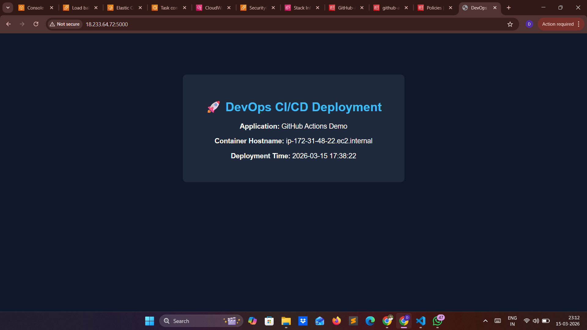
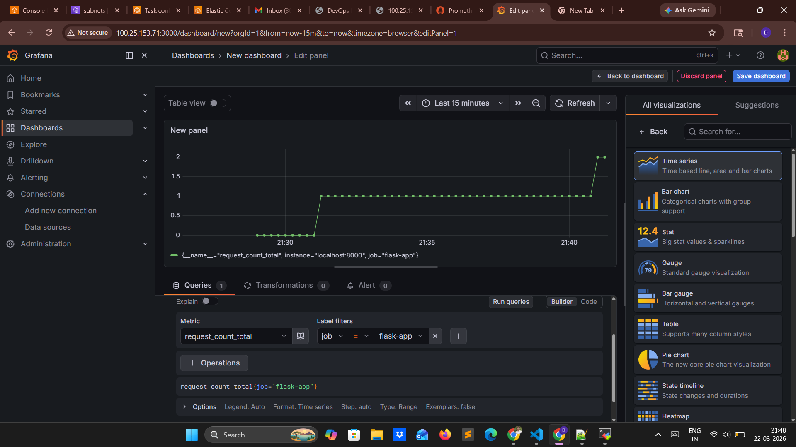

# 🚀 End-to-End DevOps Monitoring Project  
### Flask + Prometheus + Grafana + ECS + GitHub Actions + Terraform

---

# 📌 1. Project Overview

This project demonstrates a **complete DevOps lifecycle**:

- Build → Test → Package → Deploy → Monitor  
- Fully automated using CI/CD  
- Deployed on AWS ECS (Fargate)  
- Includes real-time monitoring with Prometheus & Grafana  

---

# 🎯 2. Problem Statement

Modern applications require:

- Automated deployments  
- Containerized environments  
- Real-time monitoring  

This project implements all of the above in a single pipeline.

---

# 🧱 3. Architecture

```
Developer Push (GitHub)
        │
        ▼
GitHub Actions (CI/CD)
        │
        ├── Build Docker Images
        ├── Push to Amazon ECR
        └── Deploy to ECS
                │
                ▼
ECS Fargate (Single Task)
   ├── Flask App (5000, 8000)
   ├── Prometheus (9090)
   └── Grafana (3000)
                │
                ▼
Browser → Grafana Dashboard
```

---

# ⚙️ 4. Tech Stack

| Category | Tools |
|--------|------|
| Language | Python (Flask) |
| Containerization | Docker |
| CI/CD | GitHub Actions |
| Infrastructure | Terraform |
| Cloud | AWS (ECR, ECS, IAM) |
| Monitoring | Prometheus |
| Visualization | Grafana |

---

# 📦 5. Components

## 🔹 Flask Application
- Displays hostname & timestamp
- Exposes metrics at `/metrics`
- Tracks request count

Example metric:
```
request_count_total
```

---

## 🔹 Prometheus
- Scrapes metrics from Flask app
- Runs inside ECS container

Config:
```yaml
global:
  scrape_interval: 5s

scrape_configs:
  - job_name: 'flask-app'
    static_configs:
      - targets: ['localhost:8000']
```

---

## 🔹 Grafana
- Connects to Prometheus
- Displays real-time dashboards

Data source:
```
http://localhost:9090
```

---

# 🔄 6. CI/CD Pipeline

## Trigger

```yaml
on:
  push:
    branches:
      - master
  workflow_dispatch:
```

---

## Pipeline Steps

1. Checkout code  
2. Configure AWS credentials  
3. Login to ECR  
4. Build Docker images:
   - Flask App  
   - Prometheus  
5. Push images to ECR  
6. Deploy to ECS  

---

# 🚀 7. Deployment (ECS)

## Task Definition

Contains 3 containers:

| Container | Ports |
|----------|------|
| Flask App | 5000, 8000 |
| Prometheus | 9090 |
| Grafana | 3000 |

---

## Networking

- Containers run in same ECS task  
- Communicate via `localhost`  

---

## Access

Grafana UI:

```
http://<PUBLIC-IP>:3000
```

---

# 📊 8. Monitoring Flow

```
Flask App → Prometheus → Grafana → User
```

---

## Prometheus Target

```
http://localhost:8000/metrics
```

---

## Grafana Query

```promql
rate(request_count_total[1m])
```

---

# 🖥️ 9. Outputs

## Application UI


## Prometheus Targets


## Grafana Dashboard


---

# 🔐 10. Security

| Component | Access |
|----------|--------|
| Flask App | Private |
| Prometheus | Private |
| Grafana | Public |

---

# 🧠 11. Key Learnings

- Docker multi-container setup  
- Prometheus scraping  
- Grafana dashboards  
- ECS Fargate deployment  
- Terraform infrastructure  
- CI/CD automation  
- Debugging real-world issues  

---

# ⚠️ 12. Challenges

- Docker build context issues  
- Windows path issues  
- Container networking (localhost vs IP)  
- Metrics visibility issues  
- Grafana datasource debugging  

---

# 🚀 13. Future Enhancements

- Add Application Load Balancer (ALB)  
- Enable HTTPS using ACM  
- Add CloudWatch logging  
- Add alerts in Grafana  
- Use versioned images instead of `latest`  

---

# 👨‍💻 14. Author

Dhanunjaya Nallavalli 

---

# ⭐ 15. Quick Run (Local)

```bash
git clone <repo-url>
cd project

docker build -t flask-app .
docker run -p 5000:5000 -p 8000:8000 flask-app
```

---

# 🎉 16. Final Outcome

- Automated CI/CD pipeline  
- Multi-container ECS deployment  
- Real-time monitoring dashboard  
- Production-style DevOps architecture  

---
